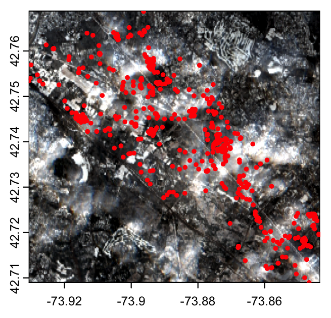
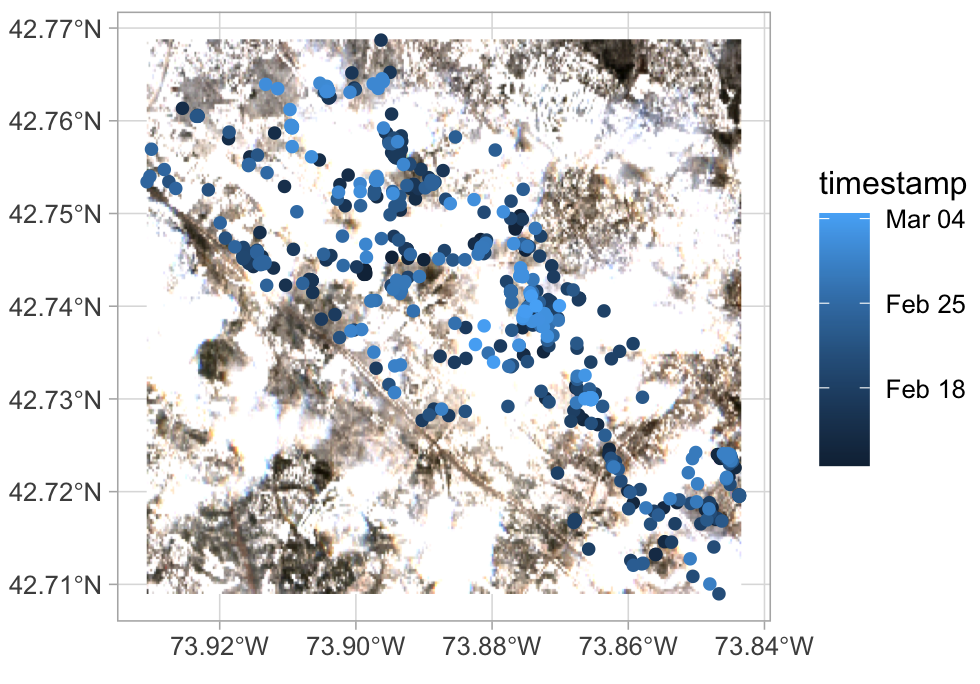
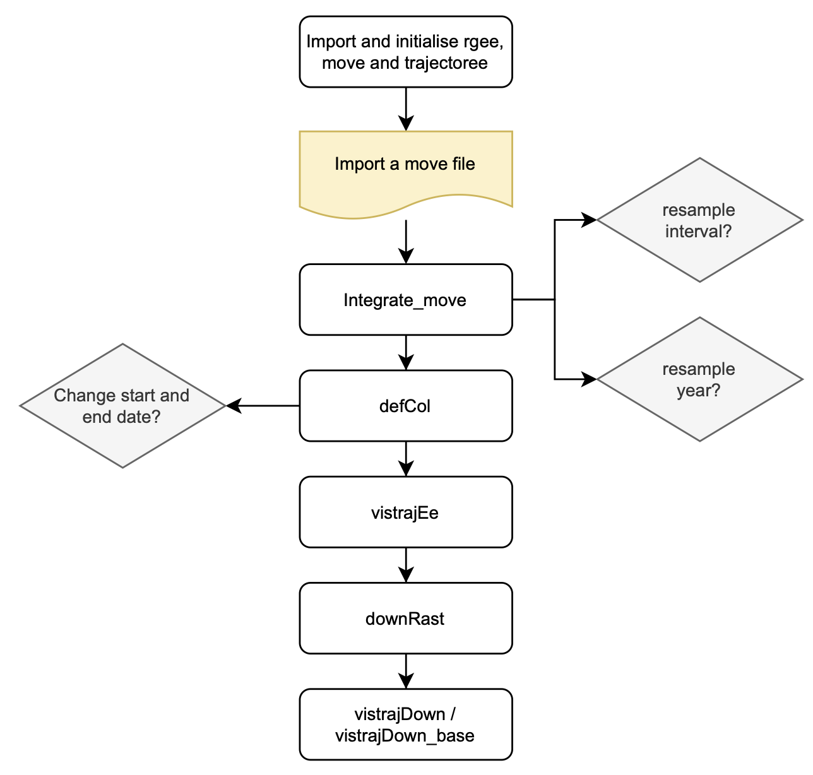

# trajectoree

#### Linking move data to reflectance values from satellite imagery and visualizing occurence probability.

A package, integrating continuous time movement models (ctmm) with the access to the Google Earth Engine cloud-based data catalogue through rgee. Based on move files of animal trajectories, satellite imagery from either Landsat-8 or Sentinel-2 can be downloaded to local and plotted (at the moment the Landsat-8 integration is still not as smooth as that of Sentinel-2). Plotting of occurence and home range estimations based on ctmm is possible, including plots for band value probability based on occurence and home range estimations.
## rgee, ctmm and move
Animal movement data can be accessed through the [move package](https://cran.r-project.org/web/packages/move/index.html).
Further information on the [ctmm package](https://ctmm-initiative.github.io/ctmm/) an learning resources can be found [here](https://animove.org/elearning/).
Installation instructions of rgee can be found [here](https://github.com/r-spatial/rgee). 
## Installation 
```
devtools::install_github("clearclar/trajectoree")
```
## Workflow 
#### Workflow part I

```
library(rgee)
library(move)
library(trajectoree)

ee_Initialize(drive = TRUE)

# Import a move file.
move_data <- move(system.file("extdata","leroy.csv.gz",package="move"))

# Resample sampling interval and time range if needed, depending on the sensor you wish to use.
# Sentinel-2 data is available reliably after 2019, Landsat-8 after 2013.
traj <- intergrate_move(move_data)

# List of bands to be selected.
bands <- list("B4", "B3", "B2", 'B8', 'B11')

# Define an Earth Engine image collection. Define trajectory file, sensor (S2/L8),
# a list of bands and a maximum cloud cover percentage.
# At the moment, the process is optimized for Sentinel-2 data and may be buggy for Landsat-8.
collection <- defCol(traj, 'S2', bands, 40)

# Calculate indices for the image collection.
procInd <- calcIndices(collection, c('NDVI', 'NDWI', 'NDSI'))

# Visualize either an RGB image or an index median composite of the collection in the map viewer panel.
visTrajEe(traj, procInd, list("B4", "B3", "B2"))
visTrajEe(traj, procInd, list("NDVI"))

# Download the satellite imagery as a median composite or individual images to your local machine.
# A copy will be saved to your Google Drive.
downRast(traj, procInd)
```
visTrajDown_base enables plotting using the R base package. visTrajDown plots using ggplot2.
 
```
# Create a plot showing the satellite image and the sampling points
visTrajDown(traj, 'img')
```


<p align="center">
  
</p>

#### Workflow part II

## References
## Further development
* Depending on the continuation of the rgee package, the trajectoree package may switch to Copernicus as a data source. Although this drastically reduces the variety of available data, it may reduce buggines.
* Alterations to extend the move and ctmm packages more efficiently.
* Incorporation of move2.
